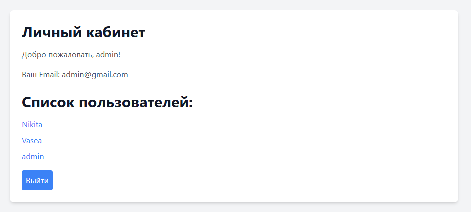

# Лабораторная работа №5. Компоненты безопасности в Laravel

## Цель работы

Познакомиться с основами компонентов безопасности в Laravel, таких как **аутентификация**, **авторизация**, **защита от CSRF**, а также использование встроенных механизмов для управления доступом.

Освоить подходы к безопасной разработке, включая создание защищенных маршрутов и управление ролями пользователей.

## Условие

В данной лабораторной работе вы реализуете основные компоненты безопасности, такие как аутентификация, авторизация, защита маршрутов и базовая работа с ролями. Дополнительно вы настроите механизм сброса пароля и исследуете логирование действий пользователя.

> [!NOTE]
> Вы можете продолжать свою прошлую работу или начать новый проект.

### №1. Подготовка к работе

1. Создайте новый проект Laravel (если не установлен) или продолжите работу с прошлым проектом.
2. Убедитесь, что переменные окружения в `.env` настроены правильно, включая подключение к базе данных.

### №2. Аутентификация пользователей

1. Создайте контроллер `AuthController` для управления аутентификацией пользователей.
2. Добавьте и реализуйте методы для регистрации, входа и выхода пользователя.
   - `register()` для отображения формы регистрации.
   - `storeRegister()` для обработки данных формы регистрации.
   - `login()` для отображения формы входа.
   - `storeLogin()` для обработки данных формы входа.
3. Создайте маршруты для регистрации, входа и выхода пользователя.
4. Обновите представления для форм регистрации и входа.
5. Создайте отдельный класс `Request` для валидации данных при регистрации или входе, либо добавьте валидацию непосредственно в контроллер.
6. Проверьте, что регистрация и вход пользователя работают корректно.

### №3. Аутентификация пользователей с помощью готовых компонентов

> [!NOTE]
> Данный шаг является дополнительным и может быть выполнен после основной части работы.

1. Установите библиотеку **Laravel Breeze** (или Fortify, Jetstream) для быстрой настройки аутентификации.
    ```bash
    php artisan breeze:install
    npm install && npm run dev
    php artisan migrate
    ```
2. Следуйте инструкциям по установке и настройке пакета.
3. Проверьте, что маршруты `/register`, `/login`, `/logout` работают корректно.

### №4. Авторизация пользователей

1. Реализуйте страницу "Личный кабинет", доступ к которой имеют только авторизованные пользователи.
2. Настройте проверку доступа к данной странице, добавив middleware `auth` в маршрут или реализовав проверку в контроллере.
3. Обновите представление страницы "Личный кабинет", чтобы отображать информацию, доступную исключительно авторизованным пользователям.

### №5. Роли пользователей

1. Добавьте систему ролей: **Администратор** и **Пользователь**.
2. Настройте поведение для каждой роли:
   1. **Администратор**: имеет возможность просматривать личные кабинеты всех пользователей.
   2. **Пользователь**: может просматривать исключительно свой личный кабинет.
3. Реализуйте проверки ролей с использованием метода `can`, `Gate`, или `middleware`, чтобы обеспечить корректное распределение прав доступа.

### №6. Выход и защита от CSRF

1. Добавьте кнопку выхода пользователя на страницу.
2. Обеспечьте защиту от CSRF-атак на формах.
3. Проверьте, что выход пользователя работает корректно и безопасно.

## Контрольные вопросы

1. Какие готовые решения для аутентификации предоставляет Laravel?
2. Какие методы аутентификации пользователей вы знаете?
3. Чем отличается аутентификация от авторизации?
4. Как обеспечить защиту от CSRF-атак в Laravel?

## Выполнение лабораторной

### №2. Аутентификация пользователей

```bash
php artisan make:controller AuthController
```
1. Создан контроллер `AuthController` для управления аутентификацией пользователей.
2. Добавьлены методы для регистрации, входа и выхода пользователя.

    ```php
    public function register()
        {
            return view('auth.register');
        }

        public function storeRegister(RegisterRequest $request)
        {
            User::create([
                'name' => $request->name,
                'email' => $request->email,
                'password' => bcrypt($request->password),
            ]);

            return redirect()->route('login');
        }

    public function login()
    {
        return view('auth.login');
    }

    public function storeLogin(Request $request)
    {
        $credentials = $request->validate([
            'email' => 'required|string|email',
            'password' => 'required|string',
        ]);

        if (Auth::attempt($credentials)) {
            $request->session()->regenerate();
            return redirect()->intended('/');
        }

        return back()->withErrors([
            'email' => 'Неверный email или пароль',
        ]);
    }

    public function logout(Request $request)
    {
        Auth::logout();

        $request->session()->invalidate();

        $request->session()->regenerateToken();

        return redirect('/');
    }
    ```

3. Созданы маршруты для регистрации, входа и выхода пользователя.

```php
Route::get('register', [AuthController::class, 'register'])->name('register');
Route::post('register', [AuthController::class, 'storeRegister'])->name('register.store');
Route::get('login', [AuthController::class, 'login'])->name('login');
Route::post('login', [AuthController::class, 'storeLogin'])->name('login.store');
Route::post('logout', [AuthController::class, 'logout'])->name('logout');
```

4. Обновлены представления для форм регистрации и входа.
5. Создайн отдельный класс `RegisterRequest` для валидации данных при регистрации.

```php
public function rules(): array
    {
        return [
            'name' => 'required|string|max:255',
            'email' => 'required|string|email|max:255|unique:users',
            'password' => 'required|string|min:8|confirmed',
        ];
    }
```

6. Было проверено, что регистрация и вход пользователя работают корректно.

### №3. Аутентификация пользователей с помощью готовых компонентов

Я не устанавливал библиотеки, потому что после установки, у меня всё сломалось.

### №4. Авторизация пользователей

1. Реализована страница "Личный кабинет", доступ к которой имеют только авторизованные пользователи.


2. Настроена проверка доступа к данной странице, добавив middleware `auth` в маршрут и реализовав проверку в контроллере.

```php
Route::middleware(['auth'])->group(function () {
    Route::get('/profile', [AuthController::class, 'profile'])->name('profile');
});
```

```php
public function profile()
    {
        $user = Auth::user();
        return view('auth.profile', compact('user'));
    }
```

### №5. Роли пользователей

1. Добавлена система ролей: **Администратор** и **Пользователь**.
2. Настроено поведение для каждой роли:
   1. **Администратор**: имеет возможность просматривать личные кабинеты всех пользователей.

        

   2. **Пользователь**: может просматривать исключительно свой личный кабинет.
3. Реализована проверки ролей с использованием метода `can`, `Gate`, чтобы обеспечить корректное распределение прав доступа.

```php
    @can('view-all-profiles')
        <h2 class="text-xl font-bold mt-6 mb-2">Список пользователей:</h2>
        <ul>
            @foreach(App\Models\User::all() as $u)
                <li>
                    <a href="{{ route('profile', ['id' => $u->id]) }}">{{ $u->name }}</a>
                </li>
            @endforeach
        </ul>
    @endcan
```

### №6. Выход и защита от CSRF
1. Добавлена кнопка выхода пользователя на страницу.

    ```php
        <form action="{{ route('logout') }}" method="POST" class="mt-4">
            @csrf
            <button type="submit" class="bg-blue-500 text-white p-2 rounded hover:bg-blue-700">Выйти</button>
        </form>
    ```

2. Обеспечена защита от CSRF-атак на формах.
3. Проверено, что выход пользователя работает корректно и безопасно.

## Контрольные вопросы

1. Какие готовые решения для аутентификации предоставляет Laravel?
    1. Laravel Breeze: Простое стартовое решение с базовой аутентификацией.
    2. Laravel Jetstream: Расширенное решение с дополнительными функциями, такими как управление командами и двухфакторная аутентификация.
    3. Laravel Fortify: Бэкенд-решение для аутентификации без предустановленного пользовательского интерфейса.
    4. Laravel Sanctum: Для SPA (Single Page Applications) и API аутентификации.
    5. Laravel Passport: Полнофункциональная реализация OAuth2.
2. Какие методы аутентификации пользователей вы знаете?
    1. Форма аутентификации (логин/пароль)
    2. Токен-основанная аутентификация (JWT, OAuth tokens)
    3. Сессионная аутентификация
    4. API ключи
    5. Биометрическая аутентификация
    6. Двухфакторная аутентификация (2FA)
    7. Единый вход (Single Sign-On, SSO)
3. Чем отличается аутентификация от авторизации?
   1. Аутентификация: Процесс подтверждения личности пользователя.
   2. Авторизация: Процесс проверки прав доступа пользователя.
4. Как обеспечить защиту от CSRF-атак в Laravel?
   1. Использование CSRF-токена в формах:

        ```php
        <form method="POST" action="/example">
            @csrf
            <!-- Поля формы -->
        </form>
        ```
    
    2. Применение Middleware: 
        ```php
        Route::middleware(['web'])->group(function () {
            // Защищенные маршруты
        });
        ```
    3. Автоматическая генерация и проверка токенов: 
    Laravel генерирует CSRF-токены для каждой сессии и проверяет их при отправке форм.